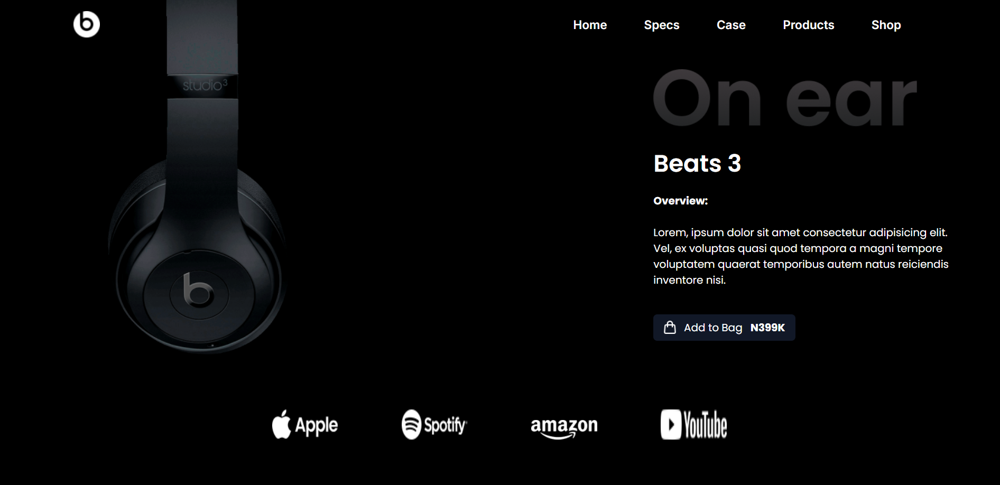
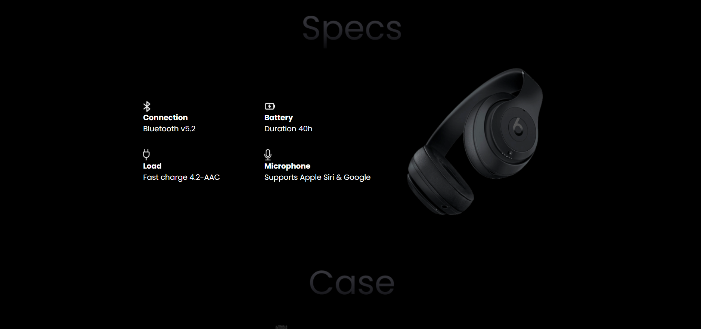
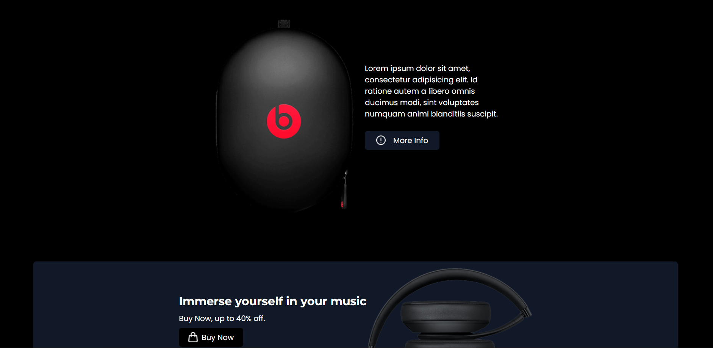
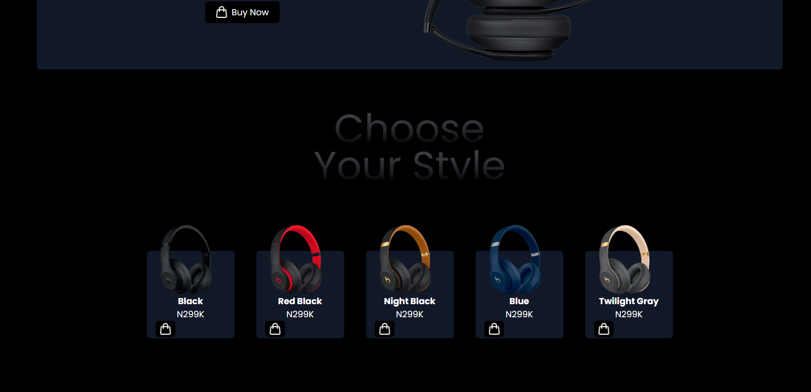

# Beats Landing Page

A responsive product landing page for Beats headphones, built using HTML and Tailwind CSS. This project demonstrates modern UI design principles, structured layout composition, and efficient styling using a utility-first CSS framework.

---

## Overview

This landing page presents a clean and visually engaging interface for showcasing a consumer audio product. It includes key sections such as product highlights, specifications, promotional content, and a structured footer.

The layout is fully responsive and adapts seamlessly across different screen sizes, ensuring usability on both mobile and desktop devices.

---

## IMAGE







## LIVE

[LIVE]()


## Features

* Responsive design with mobile-first approach
* Structured layout using Flexbox and Grid
* Utility-first styling with Tailwind CSS
* Integrated icons via Font Awesome
* Web fonts from Google Fonts
* Multiple content sections for product presentation

---

## Technologies Used

* HTML5
* Tailwind CSS (CDN)
* Font Awesome
* Google Fonts

---

## Project Structure

```id="a91kd2"
.
├── index.html
├── assets/
│   ├── images/
│   │   ├── beatsLogo.png
│   │   ├── mainImage.png
│   │   ├── product images...
│   │   └── icons...
```

---

## Getting Started

To run the project locally:

1. Download or clone the repository
2. Ensure all image assets are correctly placed
3. Open the `index.html` file in any modern web browser

---

## Responsiveness

The layout is designed with responsiveness in mind using Tailwind’s breakpoint utilities:

* **Mobile**: Optimized stacking and spacing
* **Tablet**: Adjusted layouts with flexible spacing
* **Desktop**: Multi-column structured design

---

## Code Quality Notes

* Semantic HTML structure is used throughout
* Tailwind configuration is extended for custom fonts
* Layout consistency is maintained using spacing utilities

---

## Future Improvements

* Implement a responsive mobile navigation menu
* Add interactive elements (hover effects, transitions)
* Improve accessibility (ARIA labels, alt text)
* Optimize images for performance
* Integrate a backend or cart functionality

---

## License

This project is intended for educational and demonstration purposes only.

---

## Author

  AMRITHA MOHANAN

  https://github.com/amrithaamzz


